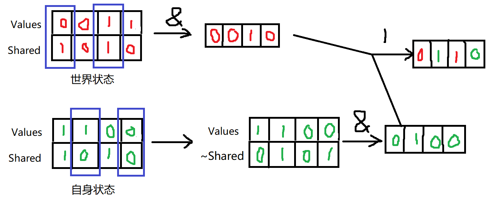

游戏AI行为决策--GOAP（目标导向型行为规划）

https://www.cnblogs.com/OwlCat/p/17936809

UpdateSelfState函数是如何融合自身状态与世界状态的，我就简单举个例吧：

项目链接
https://www.alipan.com/s/3xrVKzDFXWe

GOAP的缺点主要是在设计难度上，它的设计相较FSM、行为树那些不那么直接，你需要把控好动作的条件和影响对应的状态，比其它决策方法更费脑子些。因为GOAP没有显示的结构，如何定义好一个状态，使它能在逻辑层面合理地成为一个动作的前提条件，又能成为另一个动作条件的影响结果（比如「有流量」想想看，将其做为条件可以设计什么动作？做为影响结果又应该怎么设计呢？）是比较考验开发人员的架构设计的。但毋庸置疑的是，在面对较复杂的AI时，它的代码量一定是小于FSM、行为树和HTN的。而且添加和减少动作也不需要进行过多代码修改，只要将新行动加入到动作集或将欲剔除的动作从动作集中删去就可以，这也是它没有显示结构的好处。